# 📱 Görme Engelliler İçin Android Yardımcı Uygulaması

Bu Android uygulaması, görme engelli bireylerin günlük yaşamlarını kolaylaştırmak amacıyla geliştirilmiştir. Uygulama internetsiz çalışmakta olup, **kamera**, **sesli bildirim**, **metin tanıma** gibi birçok özellik içermektedir.

---

## 🚀 Özellikler

- 📷 **Gerçek Zamanlı Nesne Tanıma**  
  TensorFlow Lite modeli ile çevredeki nesneler algılanır ve sınıflandırılır.

- 🔊 **Türkçe Sesli Geri Bildirim (TextToSpeech)**  
  Algılanan nesneler Türkçe olarak kullanıcıya sesli bildirilir.

- 📝 **Metin Okuma Asistanı**  
  Kamera ile çekilen fotoğraftaki yazılar okunur ve sesli okunur. (ML Kit kullanıldı)

- 🎙️ **Not Asistanı**  
  Sesli komutlarla not alınabilir ve daha sonra bu notlar okunabilir.

- 🌙 **Gece Modu ve Fener Kontrolü**  
  Karanlık ortamda kameranın feneri açılabilir.

- 🖱️ **Ekran Tıklamaları ile Komutlar**  
  - 2 kez dokun: Fotoğraf çek ve metin oku  
  - 3 kez dokun: Google Asistan’ı aç  
  - Belirli sesli komutlarla ekranlar arası geçiş yapılır (`anamenü`, `yeniden oku`, `sesi kapat`, vb.)

---

## ⚙️ Kullanılan Teknolojiler

- Java & Android SDK  
- TensorFlow Lite (.tflite model)  
- ML Kit – Text Recognition  
- Camera2 API + TextureView  
- TextToSpeech (TTS)  
- SpeechRecognizer  
- Android Permissions  
- Modern UI: GridLayout + Özel Drawable Arayüzler  

---

## 📸 Uygulama Görselleri

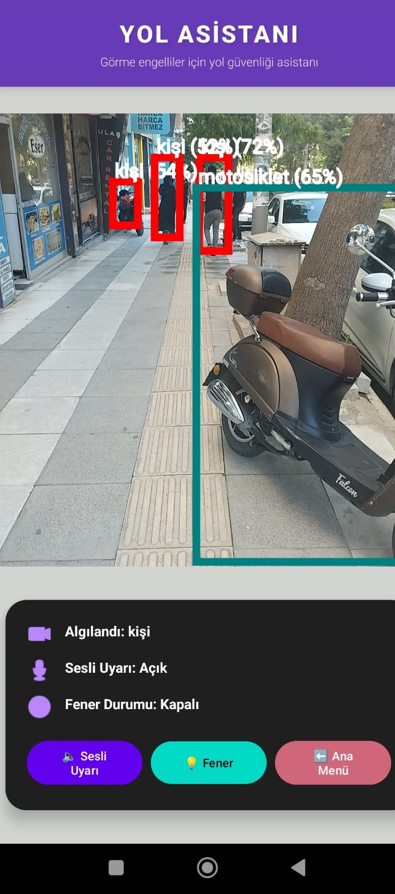  
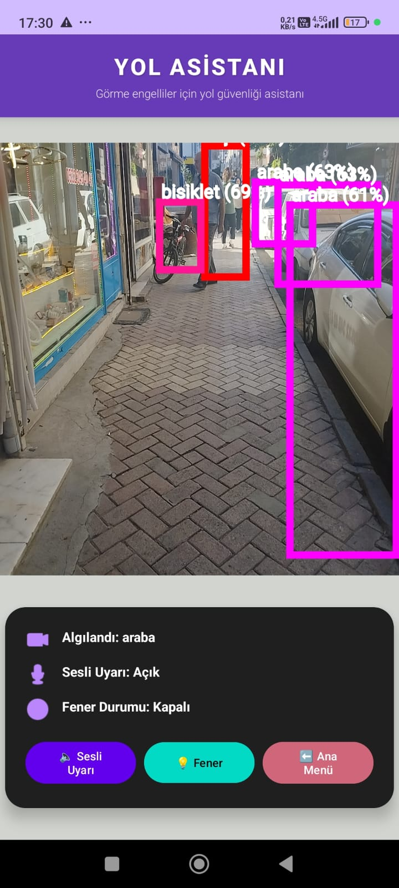  
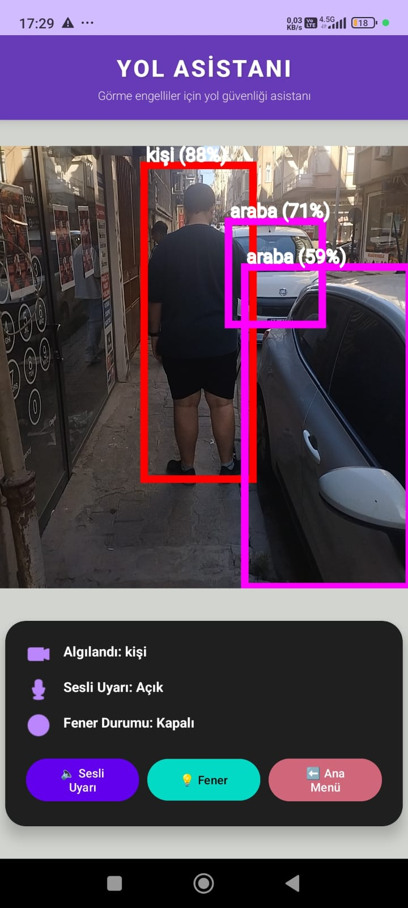  
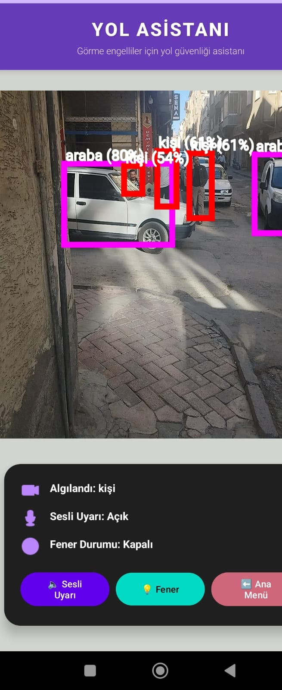  
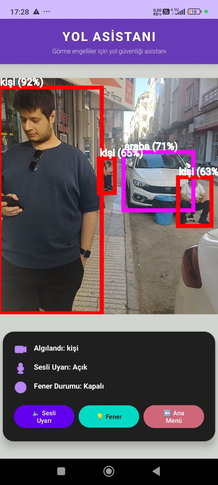  
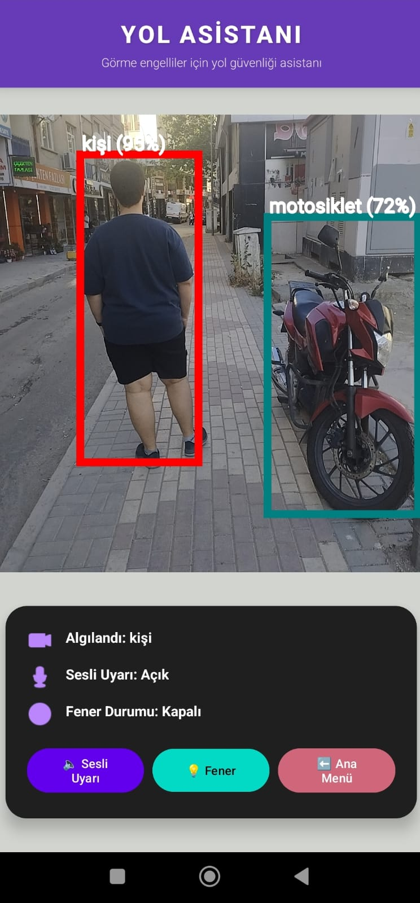  
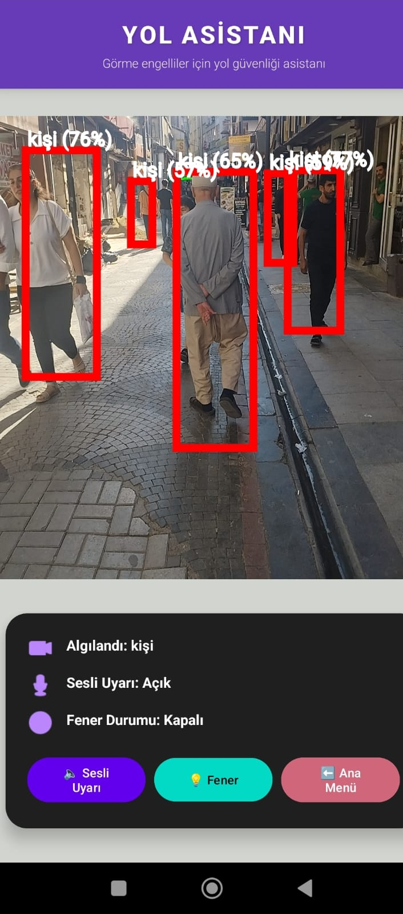  
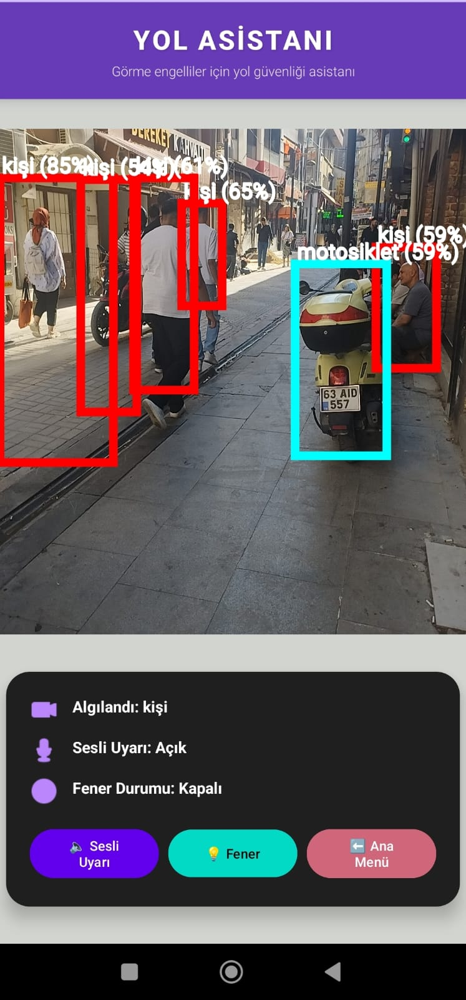  
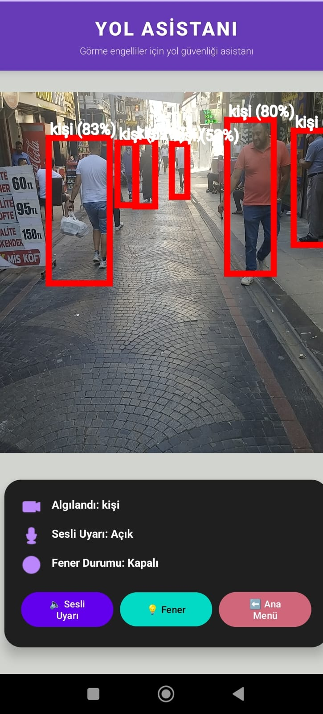  
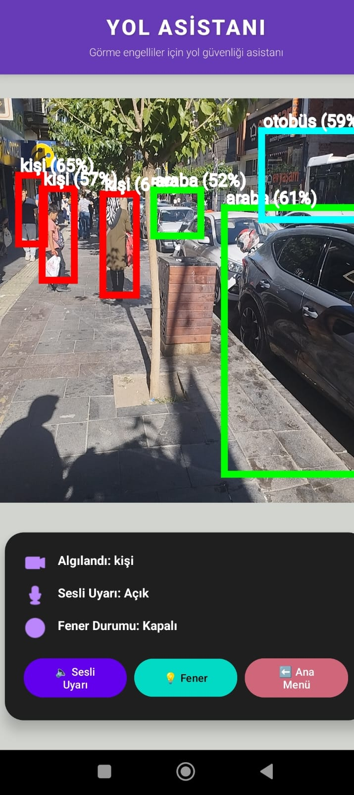  
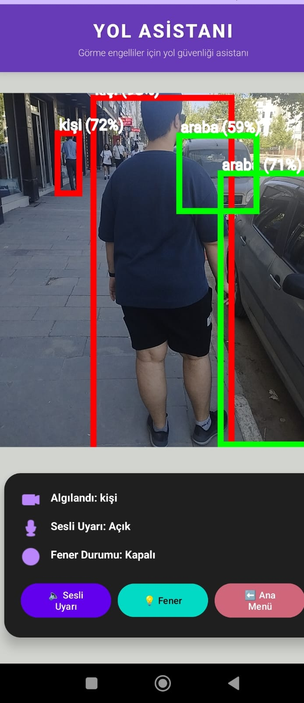  
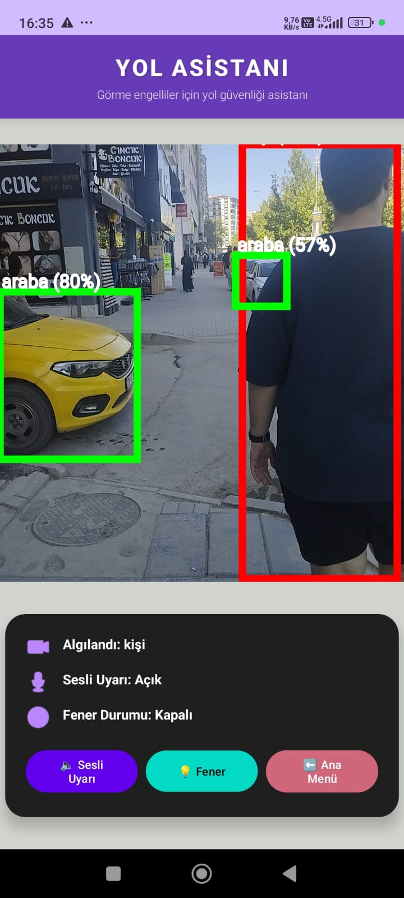  
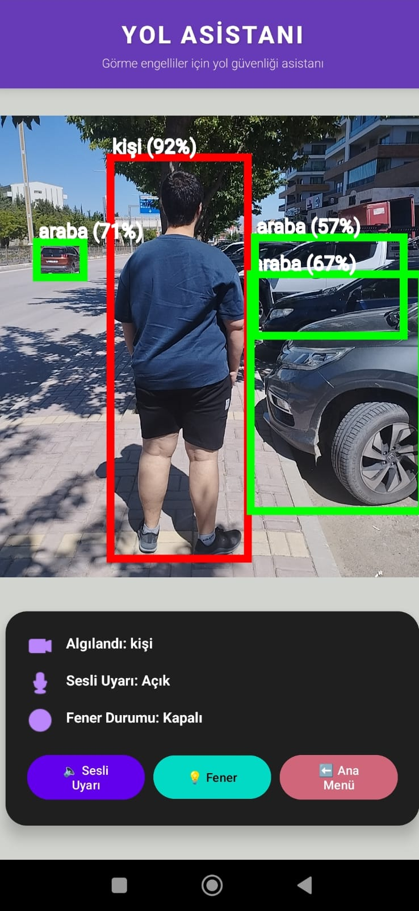  
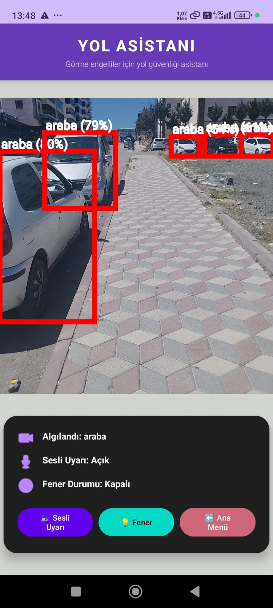  
  
  
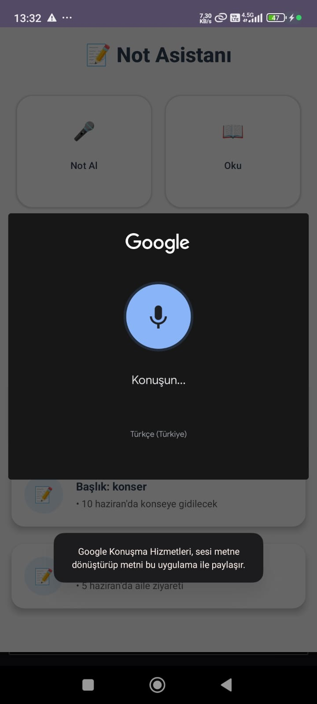  
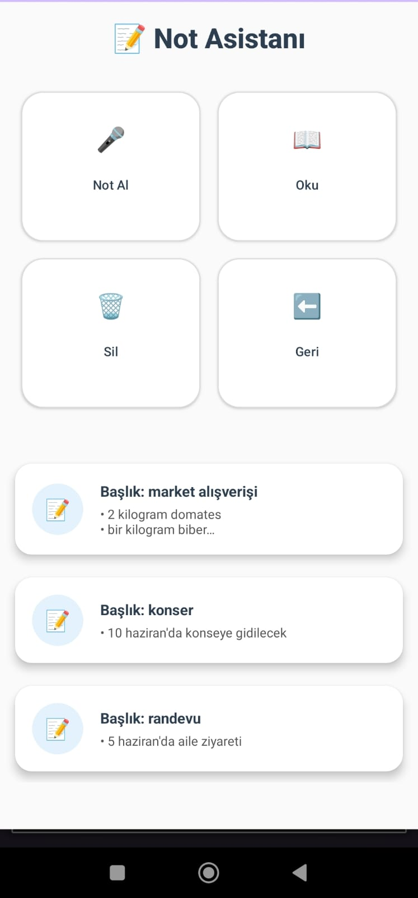  
  
  
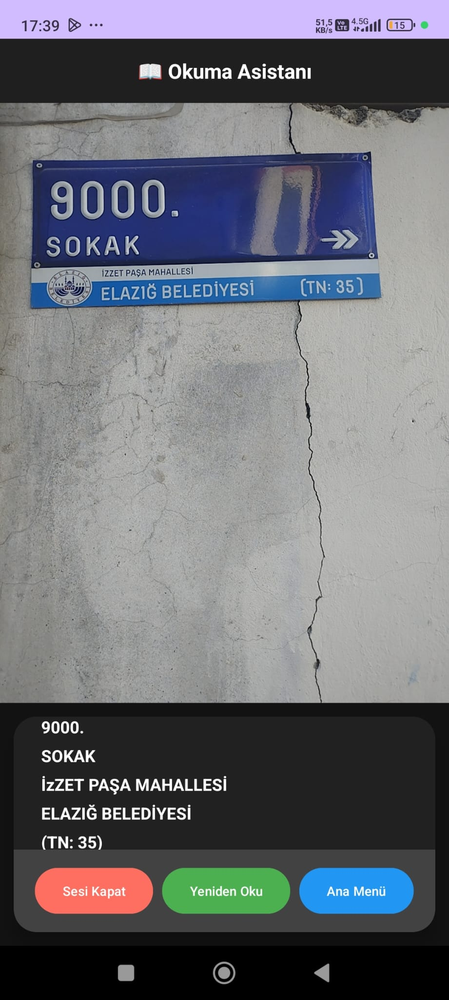  

